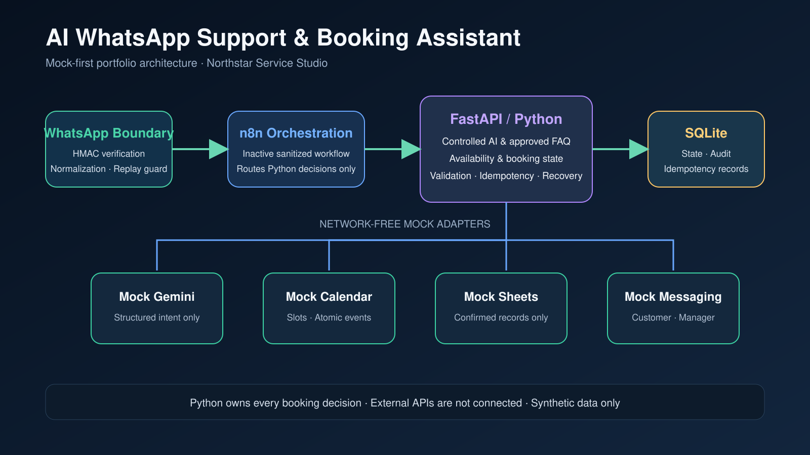
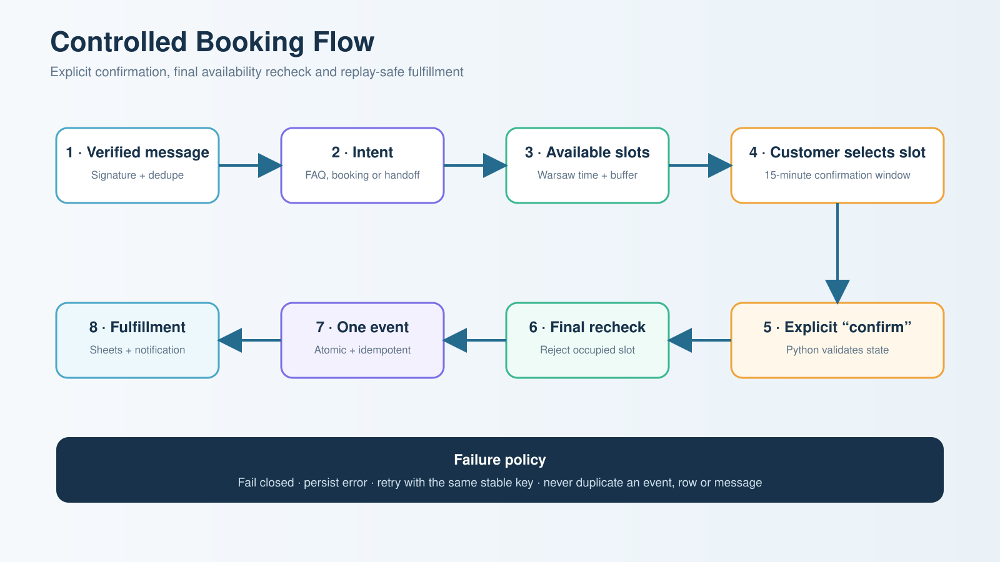
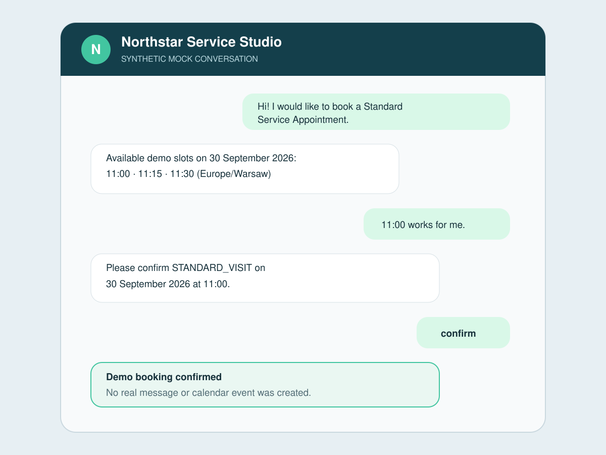
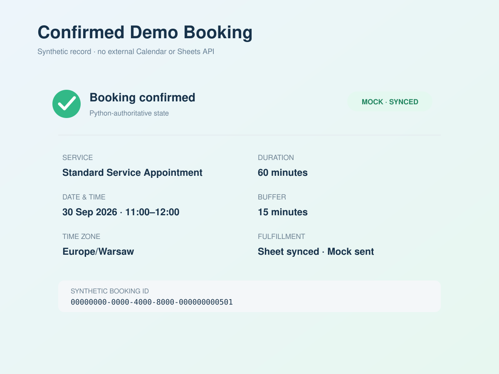
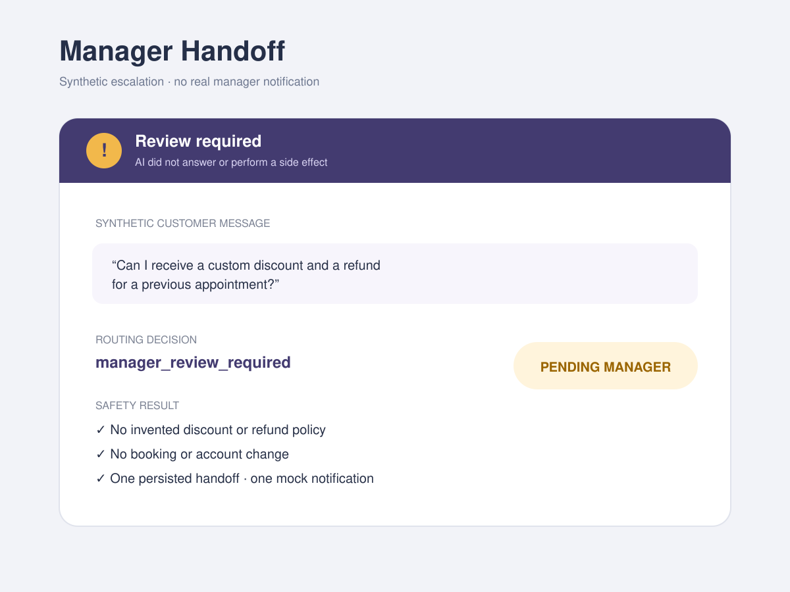

# AI WhatsApp Customer Support & Booking Assistant

Safe, mock-first customer support and appointment booking automation built with **Python, FastAPI, n8n, SQLite and controlled AI routing**.

> **Portfolio demo:** this repository represents a fictional business, **Northstar Service Studio**, and uses synthetic data only. It is not a paid client project or a production WhatsApp deployment. Real Meta, Gemini, Google Calendar and Google Sheets APIs have not been connected or verified.



## What it demonstrates

- Meta-compatible webhook challenge and HMAC-SHA256 signature verification
- defensive WhatsApp text-event normalization and replay protection
- deterministic mock Gemini intent classification with strict schemas
- FAQ answers grounded only in an approved knowledge base
- manager handoff for unknown, complex, unsafe or low-confidence requests
- Python-owned availability and booking decisions in `Europe/Warsaw`
- explicit customer confirmation before creating an appointment
- final Calendar recheck, atomic overlap protection and a 15-minute buffer
- idempotent mock Google Sheets synchronization and customer notification
- SQLite status, idempotency and audit history
- sanitized inactive n8n orchestration with no embedded credentials
- recovery from partial failures without duplicate events, rows or messages

## Verified booking flow



The complete signed-webhook-to-fulfillment path is tested for all three fictional services:

| Service ID | Demo service | Duration | Buffer |
|---|---|---:|---:|
| `INTRO_CALL` | Introductory Consultation | 30 min | 15 min |
| `STANDARD_VISIT` | Standard Service Appointment | 60 min | 15 min |
| `EXTENDED_SESSION` | Extended Service Session | 90 min | 15 min |

## Architecture

| Component | Responsibility |
|---|---|
| WhatsApp boundary | Verify signature, validate payload, normalize supported text events and deduplicate provider message IDs |
| Controlled AI layer | Classify intent, extract limited fields, ground FAQ replies and fail closed to manager handoff |
| Availability engine | Apply approved services, working hours, busy intervals, duration, buffer and Warsaw time-zone rules |
| Booking state machine | Persist selection, enforce explicit `confirm`, recheck availability and create one mock event |
| Orchestration layer | Route Python decisions, synchronize confirmed bookings and recover partial failures |
| SQLite | Store minimal pseudonymous state, idempotency records, workflow results and audit events |
| n8n | Coordinate HTTP calls only; it cannot approve or create bookings independently |

## Safety boundaries

- Every external integration is forced to `mock` mode by validated configuration.
- Gemini output never creates, confirms, cancels or reschedules a booking.
- A booking requires an approved service, valid slot, literal `confirm` and final Calendar recheck.
- Replayed webhooks, workflow calls, confirmations and fulfillment commands are idempotent.
- Sender identifiers are HMAC-pseudonymized before SQLite persistence.
- Unsupported media are recorded safely and are never downloaded.
- Prompt injection and invented services route to a manager.
- The n8n export is inactive and contains no credentials, tokens, phone numbers or personal email addresses.

## Mock-mode limitations

The project deliberately does **not** prove production connectivity, delivery or eligibility for WhatsApp Cloud API, Gemini API, Google Calendar API, Google Sheets API, or real notifications.

Production use would additionally require Meta business/app setup, approved credentials, public HTTPS webhook hosting, opt-in and template-policy compliance, Google OAuth, secret management, privacy review, monitoring and operational support.

## Project structure

```text
demo/          Synthetic knowledge, services, calendar and sample records
docs/          Phase reports, portfolio text, checklists and visual assets
n8n/           Sanitized inactive orchestration workflow
src/app/       FastAPI application and domain modules
tests/         Positive, negative, security, recovery and E2E tests
```

## Installation

Requirements: Python 3.11+ and PowerShell, Command Prompt or a POSIX shell.

### Windows PowerShell

```powershell
py -m venv .venv
.venv\Scripts\python.exe -m pip install --upgrade pip
.venv\Scripts\python.exe -m pip install -e ".[dev]"
Copy-Item .env.example .env
.venv\Scripts\python.exe -m uvicorn app.main:app --reload
```

If PowerShell blocks activation, use `.venv\Scripts\python.exe` directly as shown above; activation is optional.

### Linux or macOS

```bash
python3 -m venv .venv
.venv/bin/python -m pip install --upgrade pip
.venv/bin/python -m pip install -e '.[dev]'
cp .env.example .env
.venv/bin/python -m uvicorn app.main:app --reload
```

Open `http://127.0.0.1:8000/health`. The response must report all integrations as `mock` and `data_policy` as `synthetic_only`.

## Testing

```powershell
.venv\Scripts\python.exe -m pytest
```

Current verified result: **100 passed**. The suite covers all three services, duplicate deliveries, competing slots, confirmation expiry, Calendar response loss, integration outages, partial-failure recovery, forged signatures, malformed input, prompt injection, pseudonymization, Warsaw DST boundaries and publication assets.

## Using the mock workflow

1. Start FastAPI locally.
2. Import [`n8n/phase-6-whatsapp-booking-orchestration.workflow.json`](n8n/phase-6-whatsapp-booking-orchestration.workflow.json) into a local n8n instance.
3. Set `FASTAPI_BASE_URL` locally, for example `http://127.0.0.1:8000`.
4. Keep the workflow inactive until reviewing every node.
5. Use only synthetic payloads. The workflow calls FastAPI and contacts no external provider.

The executable E2E reference is [`tests/test_phase7_end_to_end.py`](tests/test_phase7_end_to_end.py). Demonstration data are available in [`demo/`](demo/).

## Demonstration gallery

| Synthetic conversation | Confirmed booking | Manager handoff |
|---|---|---|
|  |  |  |

## Documentation

- [Phase 7 acceptance and hardening report](docs/PHASE_7_REPORT.md)
- [Phase 8 final preparation report](docs/PHASE_8_REPORT.md)
- [GitHub publication checklist](docs/GITHUB_PUBLICATION_CHECKLIST.md)
- [Upwork portfolio copy](docs/UPWORK_PORTFOLIO.md)
- [n8n workflow notes](n8n/README.md)

## License

No open-source license is granted. **Copyright © 2026 Sergey. All rights reserved.**
